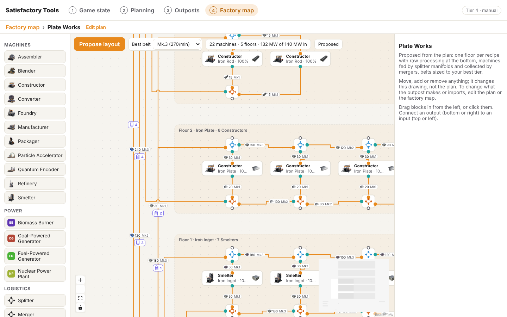

# Node editor

The node editor draws your factory as blocks joined by schematic lines, at two levels:

- **Factory map** (`#/map`): each outpost is a block, and each import between outposts is a link.
- **Floor plan** (`#/map/<outpost id>`): the inside of one outpost. Blocks are machines, generators, splitters, mergers and ports.

It sits on top of the outpost plans from the planning flow (`src/plan/`). A plan says what an outpost must deliver, which resource nodes it has and what it imports. The editor shows those plans and lets you link them up. It never stores a second copy of goals, imports or recipes.

Tracked in #12. The real floor-plan algorithm is #13.

## Factory map

Each block shows the outpost's goal, what it extracts, what it imports, what it exports (goal, surplus resources and byproducts, from the solver) and how much power it uses. Shortfalls show in red.

Links are coloured by how they travel: belt, pipe, truck, train, drone, or power line. When two outposts have several links, they are drawn side by side.

## How lines and ports are drawn

Both levels draw lines like a circuit schematic:

- Lines run horizontally and vertically with 90° corners. A line whose target is behind it goes round through the gap between blocks instead of under them.
- Where a horizontal run crosses another line's vertical run, it hops over it with a small arc, so a crossing never looks like a join. Lines that would share a channel are nudged apart.
- Every connection point is a small circle: hollow while nothing is connected to it, filled once something is (orange for inputs, teal for outputs).

This lives in `src/editor/router.ts`: each edge computes its route, registers it with the canvas, and draws hops over the other edges' vertical runs.

What you can do:

- **Add an outpost**: drag "Outpost" from the left onto the map, or click it. This creates an empty plan.
- **Import between outposts**: drag from one outpost's right edge to another's left edge. The new link imports whatever the first outpost has spare (its first open offer). If it only has power spare, you get a power line instead. Select the link to change the item, rate or transport.
- **See what you could import**: select an outpost. The panel lists its imports and exports, and everything the other outposts still have spare, each with an Import button. Power from power outposts has a Connect button.
- **Open the floor plan**: double-click an outpost, or use "Open floor plan" in its panel.
- **Delete**: select a block or link and press Delete or Backspace, or use the button in the panel. Deleting an outpost deletes its plan and any imports that came from it.
- **Edit the plan itself** (goal, resource nodes, recipes): "Edit goal, resources and recipes" opens the outpost in the planning flow.

With no outposts yet, the panel offers **Load example outposts**: Iron Fields (two pure iron nodes, makes 120 screws), Coal Power (200 MW) and Plate Works (20 Reinforced Iron Plates from imported ore and screws).

## Floor plan

The first time you open an outpost, the editor proposes a floor plan from the plan's solution:

- **One floor per recipe**, raw processing at the bottom and the goal at the top. A floor sits one level above the highest floor that feeds it.
- **Manifolds**: on each floor, a splitter chain feeds the machines for every ingredient, and a merger chain collects every product. All machines on a floor share the load at the same clock (for example 2.5 machines of work becomes 3 machines at 83.3%). Groups of more than 12 machines are drawn as one block with a count.
- **Belts sized to your best tier**: pick your best belt in the toolbar. Each belt gets the lowest Mk that carries its rate, and turns red when even the best one can't. Fluids use pipe Mk.1 and Mk.2.
- **Lanes and conveyor lifts**: belts between floors, ports and hubs run up a vertical lane per item beside the building, so they stay out of the floors. Where a belt changes floor it gets a conveyor lift marker with the number of floors (up or down).
- **Splitters and mergers** have their own symbols (blue splitter, orange merger) with the game's connection points: a splitter takes one belt in and sends up to three out (ahead, up, down); a merger takes up to three in and sends one out. Select one and use Flip to swap which side is ahead.
- **Ports** on the ground below the floors, on the left for resource nodes (with their extractor and purity) and imports, and on the right for exports. Exports are split by who takes them (one port per importing outpost), and the rest is shown as Goal or Surplus. Power lines become power ports.
- **Hubs**: when an item comes from several places or goes to several floors, a merger and splitter on the ground join them at the foot of its lane.

The toolbar shows machine count, floors and power draw against the power coming in. Warnings appear at the bottom: not enough power, shortfalls, imports nothing uses, and links on the factory map that changed since the plan was proposed.

Power outposts get a generator floor fed by fuel and water:

### Editing

Everything is editable. Drag blocks in from the left (or click them): any production machine, generator, splitter, merger, or a port for each transport. Connect an output (bottom or right handle) to an input (top or left handle). New belts take their item from whatever feeds them. Select a block or belt to edit it: machine type, recipe or fuel, clock, count and floor; port direction, transport, item and rate; belt item and rate.

Edits change the drawing, not the plan. Once you edit, the toolbar says "Edited" and **Propose layout** asks before replacing your changes. To change what the outpost makes or imports, change the plan or the factory map, then propose again.

## Storage

Plans live where the planning flow keeps them (`outposts` in localStorage). The editor adds one entry, `node-editor`, with block positions, power lines and floor plans per outpost. Both go into the existing backup file.

## Icons

Icons come from `src/data/game/icons.ts` (the game icon set, #17). The editor looks that file up at build time, so it also builds on a branch without it. When an item or building has no icon (belts, truck and train stations, the HUB at the moment), blocks show a coloured badge with the name's initials.

## Code

All of it is in `src/editor/`:

| File | What it does |
| --- | --- |
| `EditorScreen.tsx` | Both editors, the palette and the selection handling. Loaded lazily with React Flow. |
| `model.ts` | Types for links, power lines, floor plans, ports, belts; belt tier lookup. |
| `generate.ts` | The placeholder floor-plan proposal (`proposeLayout`). |
| `nodes.tsx` | Block and line components for both levels. |
| `router.ts` | Schematic routing: 90° corners, hops at crossings, lanes. |
| `Symbols.tsx` | Splitter, merger and conveyor lift symbols. |
| `Inspector.tsx` | The right-hand panel for whatever is selected. |
| `store.ts` | The editor's own stored state, the example outposts, palette lists. |
| `icons.ts`, `GameIcon.tsx` | Icon lookup with the lettered fallback. |
| `route.ts` | `#/map` routes. |

It uses [React Flow](https://reactflow.dev) (`@xyflow/react`), MIT licensed, for panning, zooming, dragging and connecting.

## Known gaps

- The floor plan is a placeholder, not an optimiser: there is no belt splitting when a rate exceeds the best belt (it is only flagged), and the layout ignores building footprints. #13 replaces it.
- Power lines are kept by the editor because the plan model has no power imports yet. Power lines don't feed into the solver.
- Floor plan edits are not checked against the plan (for example, deleting a machine doesn't show a shortfall).
- On phones you can add blocks by tapping the palette, but linking needs a drag between two small handles, which is fiddly.
