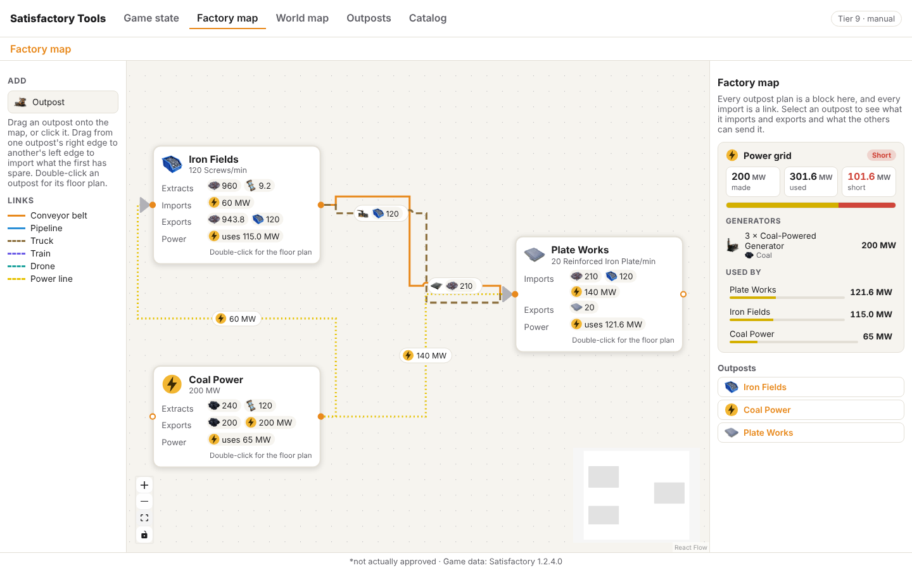
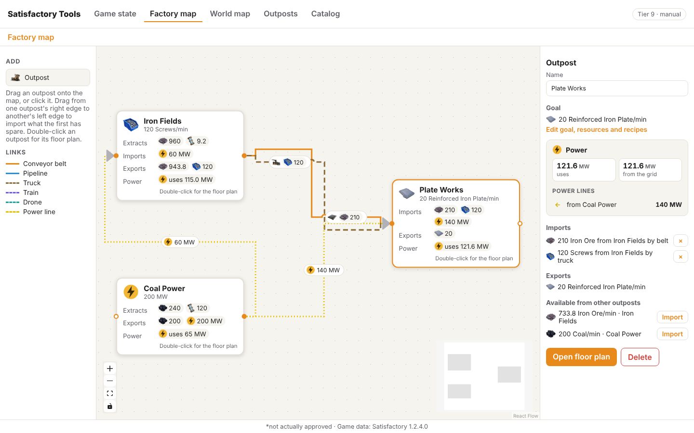
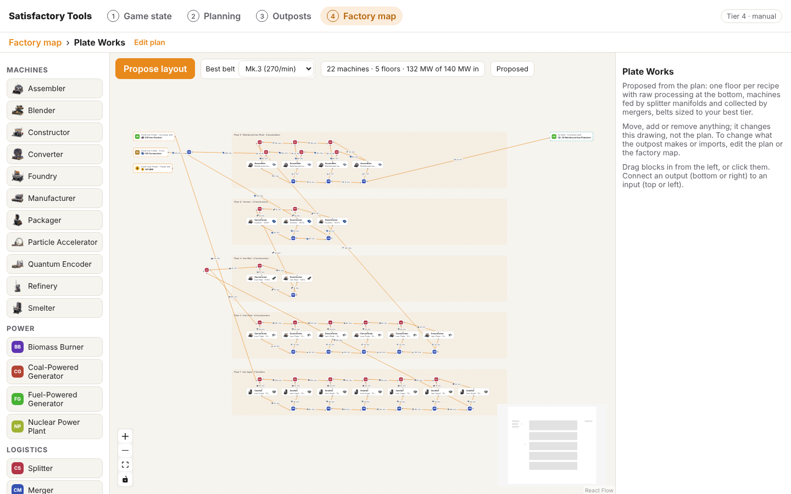
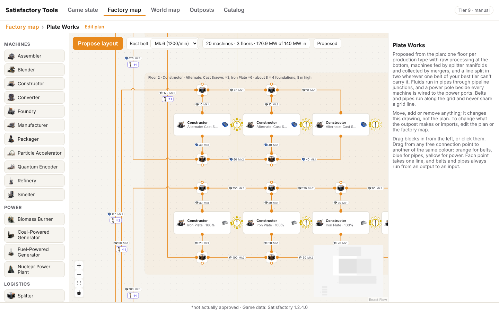
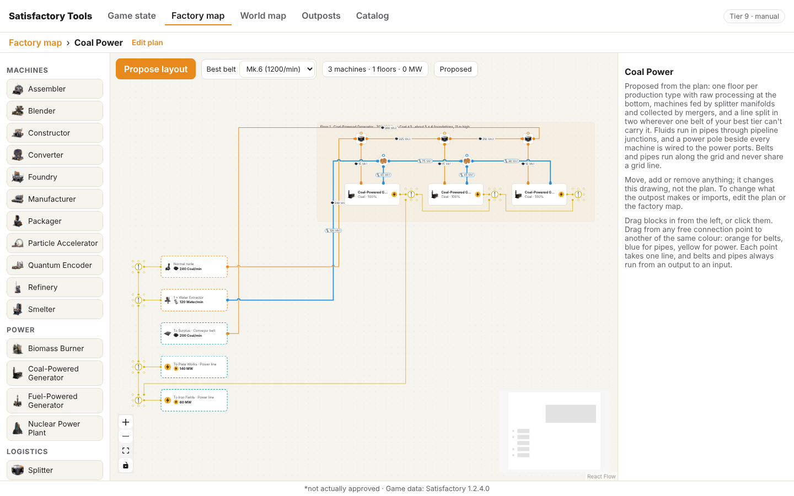
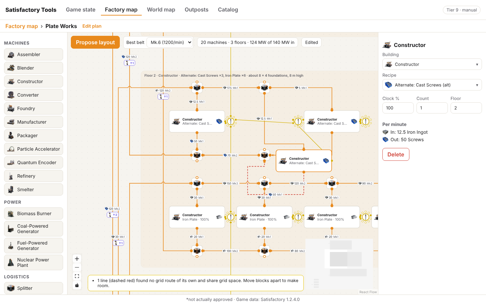

# Node editor

The node editor draws your factory as blocks joined by schematic lines, at two levels:

- **Factory map** (`#/map`): each outpost is a block, and each import between outposts is a link.
- **Floor plan** (`#/map/<outpost id>`): the inside of one outpost. Blocks are machines, generators, splitters, mergers and ports.

It sits on top of the outpost plans from the planning flow (`src/plan/`). A plan says what an outpost must deliver, which resource nodes it has and what it imports. The editor shows those plans and lets you link them up. It never stores a second copy of goals, imports or recipes.

Tracked in #12. The layout algorithm is #13, the floor-plan grid is #29.

## Factory map

Each block shows the outpost's goal, what it extracts, what it imports, what it exports (goal, surplus resources and byproducts, from the solver) and how much power it uses. Shortfalls show in red.

Links are coloured by how they travel: belt, pipe, truck, train, drone, or power line. When two outposts have several links, they are drawn side by side.

With nothing selected, the right-hand panel shows the **power grid** as a widget (#66): what the generators make, what the outposts use, and what is spare or short, as tiles and a bar that turns red past what is made. Below it are the generators (count, type and fuel) and every outpost's draw, with a bar for its share; click one to select it. All outposts share one grid for now; separate grids are #61.

## How lines and ports are drawn

Both levels draw lines like a circuit schematic: horizontal and vertical runs with 90° corners, a small hop where one line crosses another (so a crossing never looks like a join), and every connection point a small circle, hollow while free and filled once connected. On the floor plan each point is coloured by what it carries (see [Connection points](#connection-points)).

On the factory map, lines between outposts are routed one by one (`src/editor/router.ts`): a line whose target is behind it goes round through the gap between blocks, and lines that would share a channel are nudged apart.

The floor plan is stricter, see [The grid](#the-grid) below.

What you can do:

- **Add an outpost**: drag "Outpost" from the left onto the map, or click it. This creates an empty plan.
- **Import between outposts**: drag from one outpost's right edge to another's left edge. The new link imports whatever the first outpost has spare (its first open offer). If it only has power spare, you get a power line instead. Select the link to change the item, rate or transport.
- **See an outpost's power**: select it. A power widget shows what it uses and makes, what it takes from or gives to the grid, how much of its output is spoken for, and its power lines to other outposts.
- **See what you could import**: select an outpost. The panel lists its imports and exports, and everything the other outposts still have spare, each with an Import button. Power from power outposts has a Connect button.
- **Open the floor plan**: double-click an outpost, or use "Open floor plan" in its panel.
- **Delete**: select a block or link and press Delete or Backspace, or use the button in the panel. Deleting an outpost deletes its plan and any imports that came from it.
- **Edit the plan itself** (goal, resource nodes, recipes): "Edit goal, resources and recipes" opens the outpost in the planning flow.

With no outposts yet, the panel offers **Load example outposts**: Iron Fields (two pure iron nodes, makes 120 screws), Coal Power (200 MW) and Plate Works (20 Reinforced Iron Plates from imported ore and screws).

## Floor plan

The first time you open an outpost, the editor proposes a floor plan from the plan's solution (`src/editor/layout.ts`, then `generate.ts` puts it on the grid):

- **One floor per production type.** Steps that use the same machine at the same depth of the chain share a floor: smelting, then plates and rods, then screws, then assembly. A floor sits one level above the highest floor that feeds it, so raw processing is at the bottom and the goal at the top. Each floor's label gives its size in foundations (machines side by side along the manifold, a belt per input and output, a walkway) and its height.
- **Manifolds.** Each step is a row of identical machines. Above it, a splitter chain per ingredient feeds every machine; below it, a merger chain per product collects them. Machines run at full clock (#73): 2.5 machines of work is 3 machines at 100%, and the manifold feeds them in order, so the first two run full and the last one idles half the time. Belts show that: full loads into the first machines, less into the last. A plan can ask to underclock them all evenly instead.
- **Lines split to fit your best belt.** When one belt (or pipe) of your best tier can't carry a step's input or output, the step becomes several parallel lines, each with its own belts. A line also splits above 16 machines. Imports and exports that need more than one belt get one port per belt. Each belt gets the lowest Mk that carries its rate, and turns red only when even the best can't (one machine needing more than a belt carries).
- **Surplus overflows.** When the outpost has more of something than it uses (ore from a node, say), the surplus leaves through the end of the manifold that uses it: the belt carries on past the last machine to the export port, instead of being split off before the first one. That only happens when the belt has room; otherwise the surplus gets its own belt.
- **Imports are honored.** Anything the plan imports, say 240 Screws/min by truck, arrives at a port and is not made here.
- **Gutter and ports.** Every line starts at the left edge of its floor. Left of the floors is a gutter where belts climb between floors (each belt that changes floor shows a conveyor lift with the number of floors). Where one source feeds several consumers, splitters sit in the gutter next to it; where a consumer takes from several sources, mergers do. Ports sit in a column left of the gutter: resource nodes (with extractor, purity and clock) and imports first, then exports. Exports are split by who takes them (one port per importing outpost), and the rest is shown as Goal or Surplus. Power lines become power ports.

The toolbar shows machine count, floors and power draw against the power coming in. Warnings appear at the bottom: not enough power, shortfalls, imports nothing uses, lines that had to be split, and links on the factory map that changed since the plan was proposed.

Power outposts get a generator floor fed by fuel and water:

### Pipes, belts and power

Each line on the floor plan is one of three kinds, and each kind has its own colour (#47, #48):

- **Belts** (orange) carry solids. They split at splitters and join at mergers.
- **Pipes** (blue, thicker) carry fluids. They split and join at **pipeline junctions**, never at splitters or mergers. A junction has four connection points, each one in or out. Pipes are sized against pipeline Mk rates (300 and 600/min).
- **Power lines** (thin yellow) run straight from a **power pole** to a machine, generator, extractor, power port or another pole, like wires in the game. They don't follow the grid. Poles take the game's number of lines for their Mk (Mk.1 4, Mk.2 7, Mk.3 10), one per connection point round the pole.

The proposal wires power on its own: a pole right of every machine, chained along each line; a riser through every line's first pole, bottom floor first; and a pole beside each power port and resource node (extractors need power too), chained down the port column. No pole takes more than four lines, so it works with Mk.1 poles; it uses the best pole you have unlocked.

### Connection points

Every connection point is coloured by what it carries: orange for a belt, blue for a pipe, yellow for power. A free point is an empty ring, a used one is filled (#50). Each point takes exactly one line, power and pipes included; the editor refuses a second one. A line only joins points of the same kind, and belts and pipes always run from an output to an input: drag from either end and the line still runs the right way, with an arrow at its input end.

### What a belt carries

Belts and pipes work out their item and rate from what they connect (`src/editor/flow.ts`, #51). The item comes from the source end (a machine output's product, a port's item, whatever reaches a joint), or else from what the far end takes. Rates are a max flow over the lines: machine outputs and ports put in what they make, machine inputs and ports take what they need, and joints pass anything through. So a splitter shares what comes in by what each branch can take, and a merger adds up its inputs. The belt tier follows from the rate.

Select a belt to see its item and rate. Changing either sets it by hand, and the rest of the network works around it; **Work it out again** goes back to the inferred values.

### The grid

Everything on the floor plan sits on a 20 px grid (`src/editor/grid.ts`). Blocks have fixed sizes in grid cells and snap to the grid when dragged. Every connection point is a grid point on the block's border: a machine has one input per ingredient along its top, one output per product along its bottom, and a power point on its right.

Blocks never overlap (#52). A block you drop or add lands on the nearest grid spot with a free grid line all round it, so belts can reach its connection points. Power poles may sit right against a block.

Belts and pipes are routed along grid lines (`src/editor/gridRouter.ts`) with these rules:

- No two belts share a grid edge, so lines never run on top of each other.
- A belt only turns where no other belt is, and two belts only meet where they cross straight through each other (drawn with a hop).
- The grid point just outside each connection point is kept for that point's belt.
- Belts don't run through blocks. Each belt is an A* search that prefers few turns and few crossings; short belts (the manifolds) are routed first.

If a belt can't find a clean path it still gets the best one, sharing as little as possible. Such belts are drawn dashed red, and a note says how many there are.

**Splitters and mergers turn to face their belts.** Their connection points rotate (and mirror) to the orientation that points each one at the block at the other end, the single belt (into a splitter, out of a merger) counting double. Only the connection points move: the icon stays upright. Ports turn the same way.

Routes are worked out for the whole plan whenever blocks or belts change. While you drag a block its belts follow it with a plain route, and they snap back onto the grid when you drop it:

### Editing

Everything is editable. Drag blocks in from the left (or click them): any production machine, generator, splitter, merger, pipeline junction, power pole, or a port for each transport. Drag from a free connection point to another of the same colour (see [Connection points](#connection-points)). Select a block or line to edit it: machine type, recipe or fuel, clock, count and floor; port direction, transport, item and rate; belt item and rate. Short belts (a splitter dropping into its machine) show their label when selected. Deleting a block deletes its lines.

Edits change the drawing, not the plan. Once you edit, the toolbar says "Edited" and **Propose layout** asks before replacing your changes. To change what the outpost makes or imports, change the plan or the factory map, then propose again. Floor plans saved before the grid existed are moved onto it when opened. An untouched proposal from an older version of the layout (before pipes and power) is proposed again when opened; an edited one is kept as it is.

## Storage

Plans live where the planning flow keeps them (`outposts` in localStorage). The editor adds one entry, `node-editor`, with block positions, power lines and floor plans per outpost. Both go into the existing backup file.

## Icons

Icons come from `src/data/game/icons.ts` (the game icon set, #17). The editor looks that file up at build time, so it also builds on a branch without it. When an item or building has no icon, blocks show a coloured badge with the name's initials, and splitters, mergers and conveyor lifts show the editor's own symbols. Everything is looked up by game id, so new icons appear without code changes.

## Code

All of it is in `src/editor/`:

| File | What it does |
| --- | --- |
| `EditorScreen.tsx` | Both editors, the palette and the selection handling. Loaded lazily with React Flow. |
| `model.ts` | Types for links, power lines, floor plans, ports, belts; belt tier lookup. |
| `layout.ts` | The layout algorithm (`planLayout`): floors, lines, ports and which belt carries what, as plain data. |
| `generate.ts` | Puts that layout on the grid as blocks and belts (`proposeLayout`). |
| `grid.ts` | Grid size, block sizes, connection points (what each carries, in or out), and turning joints and ports to face their belts. |
| `gridRouter.ts` | Floor-plan belt and pipe routing on the grid. |
| `flow.ts` | What every belt and pipe carries, worked out from what it connects. |
| `connect.ts` | Which lines may be drawn by hand, and where a dropped block lands. |
| `nodes.tsx` | Block and line components for both levels. |
| `router.ts` | Factory-map routing and the hops drawn at crossings on both levels. |
| `Symbols.tsx` | Splitter, merger, pipeline junction, power pole and conveyor lift symbols. |
| `Inspector.tsx` | The right-hand panel for whatever is selected. |
| `PowerWidgets.tsx`, `power.ts` | The power grid and outpost power widgets in that panel. |
| `store.ts` | The editor's own stored state, the example outposts, palette lists. |
| `unlocked.ts` | `useUnlocked()`: palette and picker lists cut down to what the game state has unlocked (machines, generators, recipes, fuels, items, link types, best belt and pipe). |
| `icons.ts`, `GameIcon.tsx` | Icon lookup with the lettered fallback. |
| `route.ts` | `#/map` routes. |

It uses [React Flow](https://reactflow.dev) (`@xyflow/react`), MIT licensed, for panning, zooming, dragging and connecting.

## Known gaps

- The layout is one proposal, not a search over alternatives: it doesn't try other floor groupings or machine orders to shorten belts.
- Footprints are estimates from building sizes; they don't place real foundations or check that a floor fits a given area.
- Power lines are kept by the editor because the plan model has no power imports yet. Power lines don't feed into the solver.
- Pipes don't account for head lift: a pipe climbing several floors may need a pump in the game.
- A belt whose item doesn't match the machine input it feeds isn't flagged yet.
- Floor plan edits are not checked against the plan (for example, deleting a machine doesn't show a shortfall).
- On phones you can add blocks by tapping the palette, but linking needs a drag between two small handles, which is fiddly.
